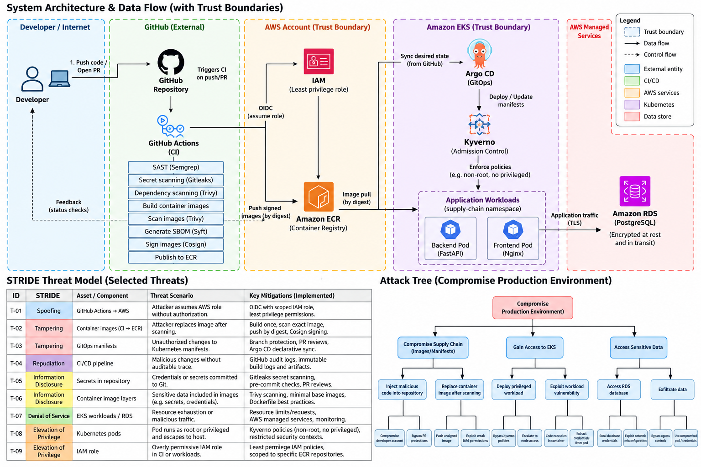

# Secure Software Supply Chain on AWS

A DevSecOps security engineering project demonstrating how source code is validated, built into immutable artifacts, scanned, inventoried, signed, promoted through GitOps, subjected to Kubernetes admission controls, and deployed to a private AWS application environment.

The primary security objective is:

> Code reaching the Kubernetes runtime should be traceable to the expected source and CI workflow, pass defined security gates, be deployed by immutable artifact identity, and execute with constrained privileges.

This repository focuses on the security properties of the delivery path rather than simply demonstrating a Kubernetes deployment.

## Security Architecture



The diagram provides a high-level view of the delivery path and major trust boundaries. The written threat model is the authoritative source for implemented controls, demonstrated evidence, and residual risk.

The complete STRIDE-based analysis is documented in [`docs/threat-model.md`](docs/threat-model.md).

## What This Project Demonstrates

### Security gates before artifact publication

The CI pipeline performs Gitleaks secret scanning, Semgrep static analysis, Trivy dependency and container vulnerability scanning, and Syft CycloneDX SBOM generation.

### Build once, scan the artifact actually published

```text
source
  |
  v
build
  |
  v
scan exact image
  |
  +----> generate SBOM
  |
  v
export exact scanned image
  |
  v
load image in publish job
  |
  v
push to ECR
```

The backend and frontend images are exported from the build/scan job and loaded by the publishing job rather than intentionally rebuilt after scanning.

### Short-lived AWS identity for CI

GitHub Actions authenticates to AWS using OIDC rather than stored long-lived AWS access keys.

### Cryptographic image signing

After publication, digest-qualified ECR images are signed using Cosign keyless signing. Independent verification evidence records the expected GitHub Actions signing identity.

See [`docs/security/container-signing-evidence.md`](docs/security/container-signing-evidence.md).

### Immutable GitOps deployment

Argo CD tracks `k8s/overlays/dev` with automated synchronization, pruning, and self-healing. Kubernetes deployments reference images by SHA-256 digest rather than mutable tags.

Final demonstrated digests:

```text
Backend
sha256:5552cf0ecc5a4e06dd4405af0457d1ff15b76c600d7468dabacc2658ae4e666e

Frontend
sha256:41882c97a420e06c0210fc6b04a4dda3af065df9cffcca1f73697c535d5db37f
```

During the AWS demonstration, Argo CD reported the application as `Synced` and `Healthy`.

### Kubernetes admission control

Kyverno policies enforce digest-qualified images, prohibit privileged containers, and require explicit non-root execution.

```text
Tag-only image      -> require-image-digest -> DENY
privileged: true    -> disallow-privileged  -> DENY
runAsUser: 0        -> require-non-root      -> DENY
compliant workload  -> all policies          -> ADMIT
```

See [`docs/security/kyverno-admission-evidence.md`](docs/security/kyverno-admission-evidence.md).

## Threat Model

The project uses STRIDE to structure threats across the delivery path.

| Category | Example threat | Primary control |
| --- | --- | --- |
| Spoofing | CI impersonates an authorized AWS identity | GitHub OIDC + scoped IAM role |
| Tampering | Published image differs from scanned image | Build once + transfer exact scanned artifact |
| Tampering | Approved deployment changes through mutable tag | SHA-256 digest pinning |
| Information Disclosure | Credential committed to repository | Gitleaks |
| Denial of Service | Accidental destructive database action | RDS deletion protection |
| Elevation of Privilege | Privileged Kubernetes workload | Kyverno privileged-container rejection |
| Elevation of Privilege | Container executes as UID 0 | Kyverno non-root enforcement |
| Elevation of Privilege | Infrastructure role receives excessive permissions | Scoped IAM policies + permissions boundaries |

Full analysis: [`docs/threat-model.md`](docs/threat-model.md).

## Attack / Control Demonstrations

| Attack / condition | Control | Observed result |
| --- | --- | --- |
| Secret scanning condition | Gitleaks | CI security gate exercised |
| Vulnerability finding | Trivy | Scanner failure/remediation evidence captured |
| Tag-only Kubernetes image | Kyverno `require-image-digest` | Rejected |
| Privileged container | Kyverno `disallow-privileged` | Rejected |
| UID 0 container | Kyverno `require-non-root` | Rejected |
| Digest + non-root + non-privileged workload | All admission policies | Admitted |

Digest rejection was demonstrated on the live EKS environment and reproduced locally. Privileged and root-container rejection were reproduced locally after AWS teardown.

## Container Runtime Hardening

Application containers use controls including:

```yaml
securityContext:
  allowPrivilegeEscalation: false
  readOnlyRootFilesystem: true
  runAsNonRoot: true
  capabilities:
    drop:
      - ALL
```

The API runs as UID `10001`; the frontend runs as UID `101`.

## AWS Security Architecture

Terraform defined a development environment including multi-AZ VPC networking, private EKS worker nodes, a private EKS API endpoint, ECR, private RDS PostgreSQL, KMS encryption controls, VPC Flow Logs, encrypted Terraform state, IAM permissions boundaries, dedicated Terraform execution permissions, and Secrets Manager-managed RDS master credentials.

The environment used a single NAT Gateway and Single-AZ RDS as explicit development/cost tradeoffs rather than production availability recommendations.

## Identity Model

Human EKS administration:

```text
IAM Identity Center + MFA
        |
        v
Dedicated EKS Platform Admin Role
        |
        v
EKS Access Entry
        |
        v
Kubernetes administration
```

Evidence: [`docs/security/eks-platform-access-evidence.md`](docs/security/eks-platform-access-evidence.md).

CI uses GitHub OIDC and a dedicated AWS role. Terraform operates through a dedicated execution role with custom permissions boundaries and scoped permissions.

## End-to-End Demonstration

```text
Git
 -> GitHub Actions security pipeline
 -> container build
 -> Trivy image scan
 -> Syft SBOM
 -> ECR
 -> Cosign signing
 -> digest promotion in Git
 -> Argo CD
 -> EKS
 -> Kyverno admission
 -> frontend
 -> FastAPI
 -> private RDS PostgreSQL
```

The live AWS environment demonstrated two Ready EKS nodes, running application workloads with the expected digest-qualified images, and an application write/read through the frontend API to private RDS.

## Security Engineering Decisions

Scanner output was treated as input to security engineering rather than as a score to maximize. Findings were remediated, accepted as explicit development risks, documented as scanner limitations, or recorded as deferred controls.

Detailed decisions: [`docs/security/security-findings.md`](docs/security/security-findings.md).

## Residual Risk and Deferred Controls

This project deliberately does not claim controls that were not demonstrated.

- **Cluster-side signature verification:** Cosign signing and independent verification were implemented; Kyverno did not verify Cosign signatures against private ECR during admission.
- **External Secrets:** Secrets Manager managed the RDS master credential and IAM/Pod Identity groundwork was implemented, but the External Secrets Operator integration was not completed.
- **Runtime detection/observability:** Falco, centralized SIEM integration, Prometheus, and Grafana were outside final scope.
- **Availability:** Single-AZ RDS was an accepted development/cost tradeoff.

## Evidence

```text
docs/
├── threat-model.md
└── security/
    ├── container-signing-evidence.md
    ├── eks-platform-access-evidence.md
    ├── kyverno-admission-evidence.md
    └── security-findings.md
```

The signing evidence contains digests from an earlier independently verified signing event. The later digests in the GitOps overlay represent the final demonstrated application deployment; these are intentionally treated as separate evidence events.

## Repository Structure

```text
.github/workflows/     CI/CD security pipeline
app/                   FastAPI backend
frontend/              React/Vite frontend
infra/                 Terraform AWS infrastructure
gitops/                Argo CD definitions
k8s/base/              Kubernetes workloads
k8s/overlays/dev/      GitOps development overlay
k8s/policies/          Kyverno admission policies
k8s/security-tests/    Admission tests
docs/                  Threat model
docs/security/         Security findings and evidence
```

## Environment Lifecycle

The AWS runtime environment was intentionally ephemeral. After deployment, security testing, and end-to-end evidence collection were complete, billable resources including EKS, RDS, NAT, ECR, and project networking were destroyed to stop ongoing cloud costs.

The Terraform configuration and bootstrap IAM model remain available to reproduce the architecture.
